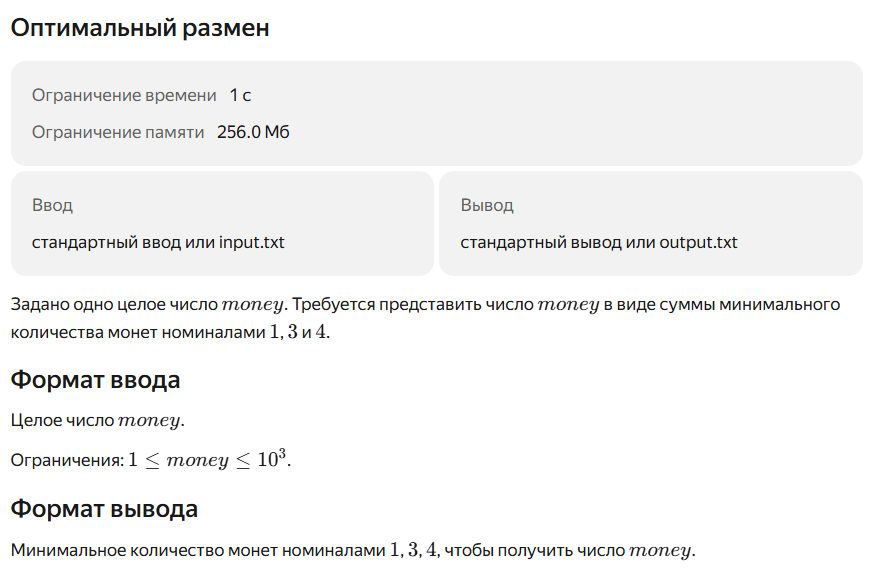
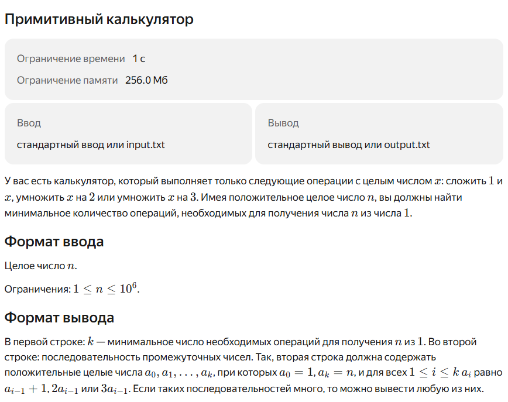

<table>
  <tr>
    <th>Ввод</th>
    <th colspan="2">Вывод</th>
  </tr>
  <tr>
    <td rowspan="2">5</td>
    <td>3</td>
  </tr>
  <tr>
    <td>1 3 4 5</td>
  </tr>
    <tr>
    <td rowspan="2">10</td>
    <td>3</td>
  </tr>
  <tr>
    <td>1 3 9 10</td>
  </tr>
    <tr>
    <td rowspan="2">17</td>
    <td>5</td>
  </tr>
  <tr>
    <td>1 3 4 8 16 17</td>
  </tr>
</table>

<table>
  <tr>
    <th>Ввод</th>
    <th>Вывод</th>
  </tr>
  <tr>
    <td>18</td>
    <td>5</td>
  </tr>
    <tr>
    <td>20</td>
    <td>5</td>
  </tr>
    <tr>
    <td>34</td>
    <td>9</td>
  </tr>
</table>

